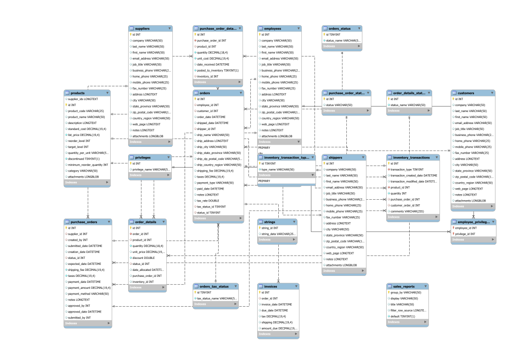
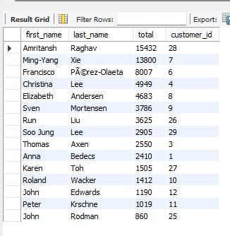
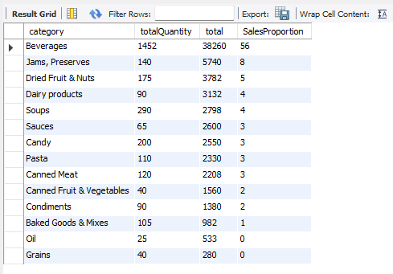
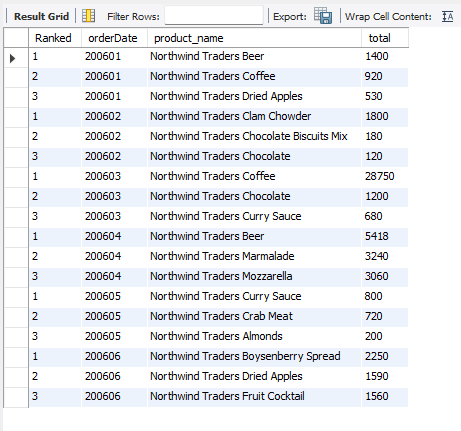
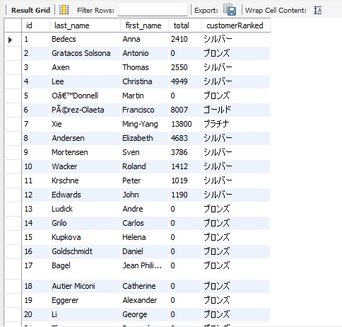

# Northwindデータベースを使用したSQL分析クエリを作成
northwindを使ってSQLを学んでみた。


# 概要

- Northwindデータベースを使い、SQLの基本的なものを書けるようになる。

# 使用技術

- MySQL
- Docker

# データベース構成図



- https://github.com/dalers/mywind データの内容をここからダウンロードさせてもらいました。

# 作成したクエリ一覧

## 1. 優良顧客を呼び出すクエリ

- 使用した構文：WITH,SUM,JOIN,GROUP BY,ORDER BY
- 目的：一番売れている顧客を特定する

```SQL
-- 優良客をよびだすクエリ
WITH purchaseTotal AS (SELECT
o.customer_id,
sum(d.quantity*d.unit_price) AS total
FROM order_details d 
JOIN  orders o
ON d.order_id=o.id
GROUP BY o.customer_id
)

SELECT 
p.customer_id,
c.first_name,
c.last_name,
p.total
FROM purchaseTotal p
JOIN customers c
ON p.customer_id=c.id
ORDER BY total DESC

```

【結果】



【メモ】
- まずは売り上げだけを求める、その後に見たい情報をすべて並べるという順番で実行することを学んだ。
- GROUPBYする際には一意のものをつかわないとエラーが出る。
- WITHを使うことで、分けて使用することができる。

## 2. 在庫の発注点を下回った商品をリストアップするクエリ

- 使用した構文：WITH,SUM,JOIN,GROUP BY,WHERE
- 目的：SUMや自分の作成した条件を実装する

```SQL
-- 現在の在庫数が発注点を下回っている商品をリストアップし、対応すべき仕入先を迅速に把握するクエリ
WITH ProductInfo AS (
SELECT
p.id,
p.product_name,
p.supplier_ids,
p.reorder_level AS needQuantity,
SUM(i.quantity) AS nowQuantity,
p.reorder_level-SUM(i.quantity) AS RequiredOrderQuantity
FROM products p
JOIN inventory_transactions i
ON p.id=i.product_id
GROUP BY p.id
)

SELECT 
p.product_name,
s.company,
s.last_name,
s.first_name,
s.job_title,
p.needQuantity,
p.nowQuantity
FROM ProductInfo p
JOIN suppliers s
ON p.supplier_ids=s.id
WHERE p.RequiredOrderQuantity>0

```

【結果】

今回は何も表示されませんでした。（データ内には発注点未満の在庫商品がなかったため）

【メモ】
- SUMを使うべきなのか（今回のreorder_levelとquantityのような）を判断するためにはそのデータが何を扱っているかを判断する必要がある。
- SELECTで名づけた名前はSELECT内では使えない（実行されていないため）
- 自分で条件を決めて実装する体験をした。

## 3. カテゴリーごとの売り上げ、売り上げの割合をリストアップをするクエリ

- 使用した構文：FLOOR,SUM,サブクエリ,JOIN,GROUP BY,ORDER BY
- 目的：サブクエリを使う、GROUPBYの使い方を理解する

```SQL
-- カテゴリーごとの売り上げ数と全体の売り上げに対する割合
SELECT 
p.category,
FLOOR(SUM(d.quantity)) AS totalQuantity,
FLOOR(SUM(d.unit_price*d.quantity)) AS total,
FLOOR(FLOOR(SUM(d.unit_price*d.quantity))/(

select FLOOR(SUM(quantity*unit_price)) AS TotalSales
from order_details
)

*100) AS SalesProportion
FROM products p
JOIN order_details d
ON p.id=d.product_id
GROUP BY p.category
ORDER BY total DESC

```

【結果】
  


【メモ】
- GROUPBYするさいにはかならずSELECTに存在しなければならず、一意のものを使用すべきである（再度認識）。
- サブクエリを使うことで強引に実装することもできるという体験
- FLOORで不要な数を切り捨てすることができる。

## 4. 月別の売り上げをトップ3に絞って商品をリストアップするクエリ

- 使用した構文：WITH,FROOL,JOIN,ROW_NUMBER,OVER,PARRTITION,DATE_FORMAT,GROUP BY,WHERE
- 目的：ウィンド関数の体験、これまでの学んだことの復習

```SQL

-- 月別売上トップ商品クエリ
WITH setOrders AS(
SELECT 
d.product_id,
FLOOR(d.quantity) AS Oquantity,
FLOOR(d.unit_price) AS OunitPrice,
o.order_date
FROM order_details d
JOIN orders o
ON d.order_id=o.id
),

RankedSales AS(
SELECT 
ROW_NUMBER() 
OVER (PARTITION BY DATE_FORMAT(o.order_date,'%Y%m')
ORDER BY FLOOR(SUM(o.Oquantity*o.OunitPrice)) DESC) AS Ranked,
DATE_FORMAT(o.order_date,'%Y%m') AS orderDate,
p.product_name,
(SELECT
FLOOR(SUM(o.Oquantity*o.OunitPrice))
) AS total
FROM setOrders o
JOIN products p
ON o.product_id=p.id
GROUP BY DATE_FORMAT(o.order_date,'%Y%m'),
p.product_name
)

SELECT *
FROM RankedSales
WHERE Ranked IN (1,2,3)

```

【結果】
  


【メモ】
- ランキングに関して、ORDERBYとLIMIの使用よりも簡単にウィンド関数を使うことで実装できる。
- 今回、日付情報では適切な形ではなかったため、DATE_FORMATで適切な形に変換した。


## 5.顧客ごとの売り上げからランクを割り当てるクエリ

- 使用した構文：WITH,GROUP BY,LEFT JOIN,SUM,FLOOR,CASE
- 目的:CASEの条件設定

```SQL

-- 条件ごとに顧客ごとのランクをまとめる
WITH OrderCustomers AS (SELECT 
c.id,
o.id AS orderId,
c.last_name,
c.first_name
FROM customers c
LEFT JOIN orders o
ON c.id=o.customer_id
GROUP BY c.id,orderId),

TotalPurchase AS (SELECT
oc.id,
oc.last_name,
oc.first_name,
SUM(d.quantity*d.unit_price) AS total
FROM OrderCustomers oc
LEFT JOIN order_details d
ON d.order_id=oc.orderId
GROUP BY 
oc.id,
oc.last_name,
oc.first_name
)

SELECT 
id,
last_name,
first_name,
FLOOR(COALESCE(total, 0))AS total,
CASE
 WHEN total>10000 THEN 'プラチナ'
 WHEN total>=5000 and total<10000 THEN 'ゴールド'
 WHEN total>=1000 and total<5000 THEN 'シルバー'
 ELSE 'ブロンズ'
END AS customerRanked
FROM TotalPurchase

```

【結果】
  


【メモ】
- LEFT JOIN を使うことでその値がないものを出力できる。
- COALESCE(total, 0)を使うことでNULLの値を0に設定することができる。
- CASEはif文のような役割を持つ、ELSEに入れればそれ以外の条件として使える。
- 一つずつ組み合わせれば目的のクエリに近づけることを学んだ。
